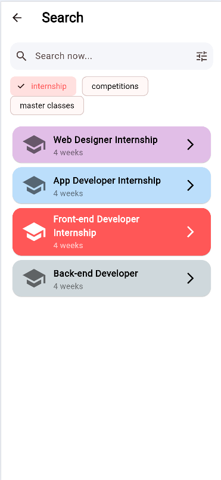

# Excelerate — Flutter Learning App

Excelerate is a modern Flutter app that helps learners discover courses, browse programs, and track progress with a clean, mobile-first UI. It includes a polished splash, login/signup, a home dashboard with “Popular Courses,” a program list with filters, and a course details screen with a persistent Enroll CTA.

## Features

- Splash → Login/Signup flow
- Home dashboard with search, hero banner, and popular courses
- Program list with chips, search, and colorful cards
- Course details with badges and bottom “Enroll Now” bar
- Bottom navigation: Home, Events, Community (chat concept), Profile
- Reusable widgets (CourseCard, PrimaryButton, StatBadge) and theming

## Tech Stack

- Flutter
- Dart
- Clean widget structure with reusable components

## Screenshots

<p align="center">
  
  
  
</p>

<p align="center">
  
  
  
  
</p>

## Getting Started

1. Install Flutter
2. Fetch dependencies:
```bash
- flutter pub get
```
3. Run:
```bash
- flutter run
```
## Project Structure
```
lib/
main.dart
theme.dart
widgets/
primary_button.dart
stat_badge.dart
course_card.dart
section_header.dart
screens/
splash_screen.dart
login_screen.dart
signup_screen.dart
home_shell.dart
home_dashboard.dart
program_list_screen.dart
program_details_screen.dart
events_screen.dart
community_screen.dart
profile_screen.dart
```
## Author
**Vetriselvan Karunanithi**  
GitHub: [vetrikarunanithi](https://github.com/vetrikarunanithi)  
LinkedIn: [Vetriselvan Karunanithi](https://www.linkedin.com/in/vetriselvank)
